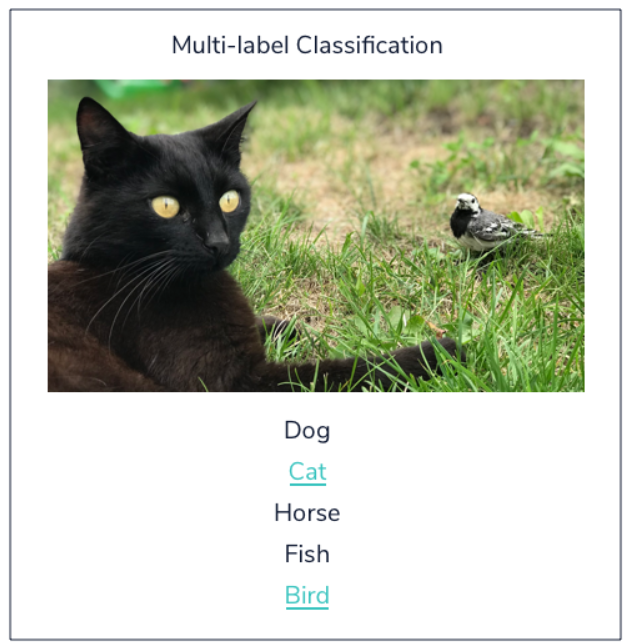
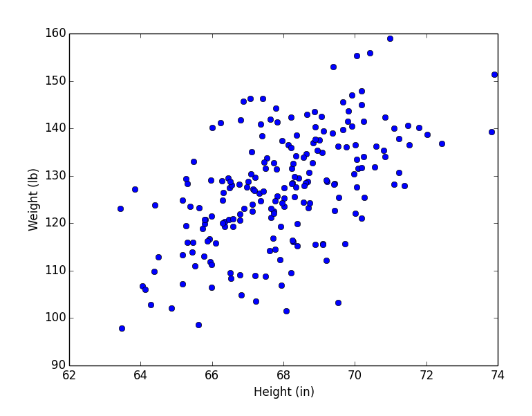
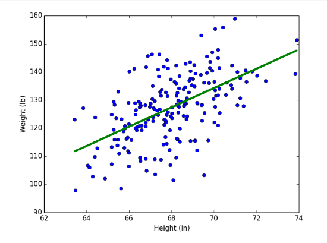

# Supervised Learning I: Regressors, Classifiers and Trees
## Introduction to Supervised Learning Part I
**Supervised Learning Part 1** sẽ cover các phần:
- Simple Linear Regression
- Multiple Linear Regression
- Logistic Regression
- the K Nearest Neighbors Algorithm
- Decision Trees Algorithms
- Evaluation Metrics to assess the performance of your models.

### Regression vs. Classification
Bài hướng dẫn 2 loại trong thuật toán **Supervised Learning**.\
ML là 1 tập hợp các techniques khác nhau phù hợp với việc trả lời từng loại câu hỏi khác nhau.\
Một cách phân loại thuật toán ML là dựa vào output của chúng và chia làm 2 loại chính: ***regression*** hoặc ***classification***.\

#### Regression
**Regression** dự đoán các output dạng *continuous*. Outputs sẽ là quantities mà có thể xác định dựa trên các inputs của models thay vì giới hạn theo 1 tập hợp xác định.\
Một số VD:
- Dự đoán chiều cao của cây dựa trên lượng mưa.
- Dự đoán mức lương dựa trên tuổi 1 người và internet tốc độ cao có available không.
- Dự đoán số km trên 1 lít xăng xe hơi dựa kích thước và năm sản xuất.

Bài đề cập ***Linear regression*** là thuật toán Regression phổ biến nhất. Thuật toán này thường không được coi trọng vì sự đơn giản của nó. Ví dụ như trong kinh doanh, chúng được sử dụng để dự đoán khả năng khách hàng rời bỏ hoặc doanh thu khách hàng tạo ra. Các models phức tạp có thể tốt hơn nhưng sẽ mất sự đơn giản.

#### Classification
**Classification** sử dụng dự đoán các *discrete label*. Outputs sẽ trong một tập hữu hạn các outcomes có thể có. Nếu tập có 2 outcomes thì là ***binary classification*** (True/False, 0 or 1, Hotdog / not Hotdog).\
Ví dụ:
- Dự đoán email có bị spam hay không
- Dự đoán trời mưa hay không
- Dự đoán người dùng là đàn ông hay phụ nữ

Bài cũng đề cập một số loại **Classification** phổ biến: ***multi-class classification*** và ***multi-label classification***.\
***Multi-class classification*** giống ***binary classification*** nhưng output sẽ có nhiều outcomes hơn (>2). Ví dụ:
- Dự đoán bức ảnh là đào, táo hay lê
- Dự đoán chữ cái viết tay là chữ gì
- Dự đoán liệu giỏ hoa quả là nhỏ, trung bình hay lớn

Một note quan trọng về ***binary classification*** và ***Multi-class classification*** đó là, từng outcome sẽ có label riêng biệt. \
Tuy nhiên trong ***multi-label classification***, có nhiều possible labels từng outcome. Điều này hữu dụng khi làm các bài toán *customer segmentation*, *image categorization* và *sentiment analysis for understanding text*. Để làm các bài **classifications** này, ta thuờng sử dụng các models như *Naive Bayes*, *K-Nearest Neighbors*, *SVMs*, cũng như các *deep learning models*.\
Ví dụ như trong hình ảnh này, cat và bird được nhận dạng trong ảnh, và ta thấy classification model cho phép nhiều labels trong kết quả.\
\
Nói chung, chọn model là bước quan trọng trong quá trình làm bài toán Machine Learning. Một model phù hợp với câu hỏi của bạn là rất quan trọng. Khi chọn model phù hợp và chính xác, ta sẽ có thể tháy các kết quả có ý nghĩa và thú vị.

## LINEAR REGRESSION
Mục đích của ML thường là tạo model mà giải thích được real-world data và chúng ta có thể dự đoán điều gì có thể xảy ra với các inputs khác nhau.\
Model đơn giản nhất chúng ta có thể đưa ra là một đường thẳng. Khi chúng ta tìm được 1 đường line mà tập hợp data một cách tốt nhất, đó là khi chúng ta đang làm ***Linear Regression***.\
Ví dụ như chúng ta có một tập hợp các data points plot cân nặng và chiều cao của các VĐV bóng chày chuyên nghiệp\
\
Một linear model giúp predict data:\
\
Một line model sẽ được định nghĩa dựa trên *slope* và *intercept*, cho từng điểm `y`: `y = mx + b`\
trong đó m là *slope*, b là *intercept*.\
Khi chúng ta thực hiện ***Linear Regression***, mục tiêu là sẽ tìm best `b` và `m` cho data của chúng ta. Tuy vậy với từng data point, chúng ta tính toán *loss*, nhằm tính việc model dự đoán tệ như nào. Việc tổng loss các data points càng nhỏ sẽ tương đương model predict càng tốt.\
Trong Python, ta sử dụng **LinearRegression** trong **sklearn**
```
from sklearn.linear_model import LinearRegression

line_fitter = LinearRegression()
line_fitter.fit(X, y)

y_predicted = line_fitter.predict(X)
```
***Note:***
- `line_fitter.coef_` trả ra *slope*
- `line_fitter.intercept_` trả ra *intercept*